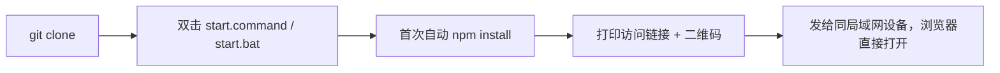
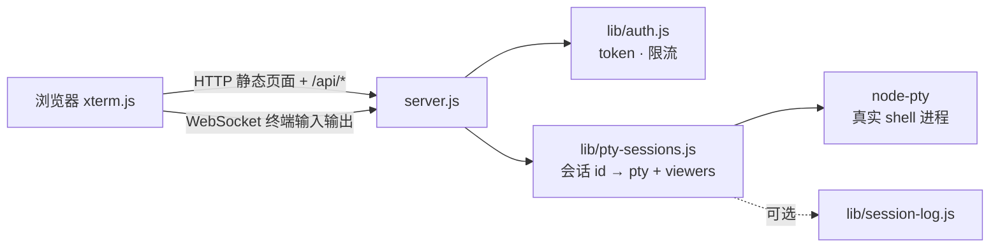
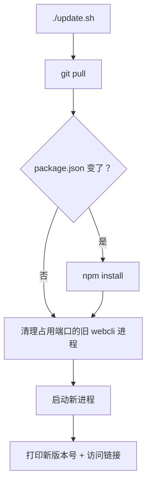

# webcli

局域网网页终端：浏览器打开一个网页，就能看到并操作这台电脑上一个**完整、可交互**的终端（`vim`/`top`/`ssh` 等全屏程序都能正常用，跟本地开一个真终端窗口体验一致）。适合"在另一台电脑或手机上，临时操作一下这台机器"的场景。

## 目录

- [快速开始](#快速开始)
- [控制面板](#控制面板推荐日常入口)
- [架构设计](#架构设计)
- [功能与解决的问题](#功能与解决的问题)
- [更新流程](#更新流程)
- [权限与访问控制](#权限与访问控制)
- [开机自启](#开机自启可选)
- [环境变量](#环境变量)
- [安全须知](#安全须知)
- [已知问题](#已知问题)

## 快速开始

**前提**：装好 [Node.js](https://nodejs.org/)（18+）。

```bash
git clone https://github.com/zhaosay/webcli.git
cd webcli
```

| 操作 | macOS | Windows |
| --- | --- | --- |
| 启动 | 双击 `start.command` | 双击 `start.bat` |
| 日常控制面板（推荐） | 双击 `webcli.command` | 见下方[控制面板](#控制面板推荐日常入口) |
| 端口被占用 | 已自动清理，见[已知问题](#已知问题) | 同左 |



启动成功后终端会打印：

```
[webcli] open: http://<这台电脑名>.local:3050/?token=xxxxxxxxxxxxxxxx
```

把这个完整链接发给同局域网内想连接的设备，浏览器直接打开即可——**对方不需要装任何东西**。也可以在页面顶部点"复制链接"按钮拿到当前地址，或者手机直接扫启动时打印的二维码。

> Token 每台电脑各自生成，存在项目目录上一级的 `../data/webcli/token.txt`，不进 git；只要不删这个文件，重启服务链接不变。默认端口 `3050`，可用 `PROJECT_PORT=8080 ./start.sh` 覆盖。

## 控制面板（推荐日常入口）

不想记一堆脚本名字，双击 `webcli.command`（macOS）或跑 `./webcli.sh`，是个选数字的菜单：

```
  状态   ● 运行中 (端口 3050)
  链接   http://xxx.local:3050/?token=xxxxxxxx
  二次验证 关   会话记录 关

  1  启动 / 重启          5  二次验证开关
  2  停止                 6  重新生成 token
  3  更新代码并重启        7  会话记录开关
  4  显示访问链接和二维码   8  查看日志
                          9  安装全局 webcli 命令
                          u  卸载（删除所有数据和代码）
```

选 `9` 装成全局命令后，任何目录敲 `webcli` 都能呼出这个面板，`webcli 3` 直接更新重启。下面各节讲的都是这个菜单背后对应的脚本，想直接用命令行操作也可以。

**卸载**：`./uninstall.sh`（或 `uninstall.bat`，或面板选 `u`）——停止服务、删掉开机自启项和全局命令、删掉运行时数据（token/日志/证书），最后连项目代码目录本身一起删掉。不可撤销，需要手动输入大写 `DELETE` 确认；如果项目目录里有还没提交的改动，会先警告一遍。只想清空数据、保留代码以后还能用的话，手动删 `../data/webcli/` 这一个目录就够了，不用跑这个脚本。

## 架构设计

| 层 | 文件 | 作用 |
| --- | --- | --- |
| 入口 | `server.js` | 建 HTTP/WebSocket server，接上路由和会话管理，可选加载 TLS 证书 |
| 配置 | `lib/config.js` | 端口、数据目录、各类超时/保留期常量，均可用环境变量覆盖 |
| 鉴权 | `lib/auth.js` | token / 二次验证密钥校验、WebSocket 同源校验、按 IP 限流锁定 |
| 会话管理 | `lib/pty-sessions.js` | 每个会话 id 对应一个真实 shell 进程 + 一组正在看它的连接（`viewers`），支撑多设备同时挂载、断线宽限期、输出缓冲回放 |
| HTTP 路由 | `lib/routes.js` | 静态文件 + `/api/name`、`/api/version`、`/api/connections`、`/api/auth-status` |
| 会话记录 | `lib/session-log.js` | 可选把终端输出落盘，按天数自动清理 |
| 二维码 / 图标 | `lib/qr.js`、`lib/icon.js` | 启动时终端打印二维码、PWA 图标 |
| 前端 | `public/index.html` | 单文件，[`xterm.js`](https://xtermjs.org/) 渲染终端，原生 WebSocket，无需构建 |
| 运行时数据 | `../data/webcli/` | token / 电脑名 / 日志 / 证书，存在项目目录**外层**，不进 git、不跨机器共享 |



## 功能与解决的问题

| 功能 | 解决的问题 |
| --- | --- |
| 多设备同时查看同一终端 | 手机 + 笔记本想一起盯着同一个会话，尺寸自动取最小的那台 |
| 断线重连 + 输出回放 | wifi 抖动、笔记本合盖、切网络导致会话/画面丢失 |
| 二维码连接 | 手机上手动敲长链接太麻烦 |
| 端口占用自动清理 | 忘记关旧进程导致启动时 `EADDRINUSE` 报错 |
| 重新生成 token | 链接不小心截图分享/被人看到浏览器历史 |
| 可选会话记录 | 想事后查这台电脑被远程做了什么 |
| 可选二次验证 | token 单独泄露时再加一道独立防线 |
| 主题 + 头部重新分组 | 界面拥挤，看不清当前谁连着 |
| 快捷命令面板 | 常用命令（`cd` 到某目录、跑某个脚本）每次都要重新敲 |
| 版本号常驻显示 | 多台电脑各自更新，版本容易对不上，出问题不好排查 |
| 拖拽文件上传 | 传文件到远程机器不方便 |

## 更新流程

```bash
./update.sh   # 或双击 update.command / update.bat，或控制面板选 3
```



全程不需要手动干预。多台电脑各自更新，页面头部（电脑名旁边）和启动日志都会显示当前版本号，方便确认这台机器到底跑的是哪个版本。

## 权限与访问控制

<table>
<tr><td width="200"><b>分享链接</b></td><td>

启动日志里 `open:` 那行就是完整链接，或页面顶部"复制链接"按钮。链接里带 token，**泄露给谁就是把 shell 权限给了谁**——不要发到公开群里。

</td></tr>
<tr><td><b>二次验证</b><br><sub>默认关闭</sub></td><td>

```bash
./auth.sh on|off|status
```

除了链接里的 token，再要求单独输入一把密钥（不放在 URL 里，不容易随链接一起泄露）。立即生效，不打断正在跑的终端。

</td></tr>
<tr><td><b>重新生成 token</b></td><td>

```bash
./token.sh regen|status
```

怀疑链接泄露了就换一把新的。`regen` 会**立即重启服务**，把当前所有连接（不管是谁）强制踢掉，旧链接全部失效。

</td></tr>
<tr><td><b>会话记录</b><br><sub>默认关闭</sub></td><td>

```bash
./log.sh on|off|status|list
```

只记屏幕输出、不记按键（`sudo` 密码本来就不回显，天然不会被记下来）；但 `cat` 过的文件内容会原样进日志，把日志目录当敏感文件对待。默认保留 7 天，`less -R <文件>` 查看效果最接近原始终端。

</td></tr>
<tr><td><b>HTTPS</b><br><sub>默认关闭</sub></td><td>

```bash
WEBCLI_TLS=1 ./start.sh
```

首次启动自动生成自签名证书，浏览器会警告一次"不受信任"，点继续即可。剪贴板、PWA、Service Worker 都要求安全上下文，只有开了这个才完全好用。

</td></tr>
</table>

## 开机自启（可选）

| | macOS | Windows |
| --- | --- | --- |
| 启用 | `launchctl load ~/Library/LaunchAgents/com.webcli.server.plist`<br><sub>模板见 `contrib/com.webcli.server.plist`，先替换里面的路径占位符</sub> | `schtasks /create /tn "webcli" /tr "C:\path\to\webcli\start.bat" /sc onlogon` |
| 禁用 | `launchctl unload ~/Library/LaunchAgents/com.webcli.server.plist` | `schtasks /delete /tn "webcli" /f` |

## 环境变量

| 变量 | 默认 | 说明 |
| --- | --- | --- |
| `PROJECT_PORT` | `3050` | 监听端口 |
| `WEBCLI_TLS` | `0` | `1` 启用自签名 HTTPS |
| `RECONNECT_GRACE_MS` | `86400000`（24 小时） | 断线后会话保留时长（毫秒） |
| `SCROLLBACK_BYTES` | `262144` | 重连回放的输出上限 |
| `LOG_RETENTION_DAYS` | `7` | 会话日志保留天数 |
| `WEBCLI_UPLOAD_DIR` | `~/webcli-uploads` | 拖拽上传的落地目录 |

## 安全须知

> 这是"局域网内部小工具"的信任模型，**不是给公网用的**：默认没有 HTTPS（明文传输）；服务监听 `0.0.0.0`，VPN/热点共享等网络里也能连进来；没有账号体系，谁有 token 谁就能跑任意命令；默认无操作审计。已经做的防护：WebSocket/写接口同源校验、鉴权失败每 IP 10 次锁 5 分钟、`Referrer-Policy: no-referrer`、上传文件名剥离目录穿越。**怀疑 token 泄露就 `./token.sh regen`。**

## 已知问题

- **端口被占用**：`start.sh`/`start.bat` 会自动清理"确认是 webcli 自己"的残留进程再启动；如果占用的是别的程序，会提示你换端口，不会误杀
- `node-pty` 的 prebuilt 二进制解压后偶尔丢失可执行位，`start.sh` 已用 `chmod +x` 兜底
- 首次监听端口时 macOS 可能弹防火墙提示，点允许即可
